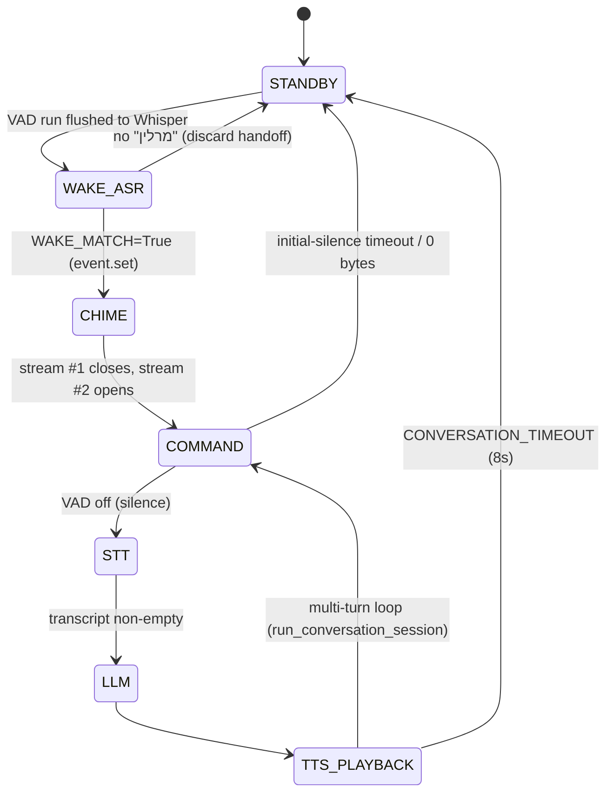

# Merlin Voice Runtime — Production Architecture Review
Read-only. No code was modified to produce this. Generated 2026-08-06.
Sources: direct reads of `service/wake_trigger.py`, `service/merlin_service.py`,
`service/vad_config.py`, `service/wake_gate.py`, plus an 8-dimension parallel
analysis (7 dimensions completed; `streams` reconstructed from direct reads
after the run hit the account monthly spend limit).

---

## 1. Runtime overview (mic → standby)

```
main() while True                              service/merlin_service.py:944
 └─ trigger.wait()  ── run_in_executor ──►  WakeTrigger._wait_blocking   wake_trigger.py:736
        opens InputStream #1 (wake)                                       wake_trigger.py:839
        KeywordBuffer VAD-gates speech → Whisper → sets event on "מרלין"  wake_trigger.py:562-567
        event.wait() returns → with-block EXITS → stream #1 CLOSES        wake_trigger.py:880-882
        drain_pending() → post-keyword handoff chunks                     wake_trigger.py:888
 ◄─ returns `pending`
 ├─ player.chime()  (fire-and-forget afplay ~1.36s)                       merlin_service.py:948,166
 └─ run_conversation_session(prefill=pending)  while True                 merlin_service.py:810
        record_utterance(prefill)  opens InputStream #2 (command)         merlin_service.py:525
        STT → stream_response(LLM→TTS→playback via sd.play/OutputStream)  merlin_service.py:838
        asyncio.create_task(_extract_background(...))  (not awaited)      merlin_service.py:846
        loop; return to standby after CONVERSATION_TIMEOUT=8s silence     merlin_service.py:106
```

**Two sequential InputStreams, never one long-lived stream.** The wake stream
closes before the command stream opens — the structural gap where command audio
is lost.

---

## 2. Stream ownership map

| # | Stream | Opened | Closed | Args | Notes |
|---|--------|--------|--------|------|-------|
| S1 | Wake listen | `wake_trigger.py:839` | with-exit after `event.wait()` `:882` | `device=None, samplerate=None, channels=None, float32` | callback hardcodes **channel 1** `:791` |
| S2 | Command record | `merlin_service.py:525` | with-exit on `stop`/timeout | `samplerate=None, channels=None, float32` | callback picks **loudest** channel `:402` |
| S3 | Barge-in | `merlin_service.py:725` | — | 20ms blocks | **dead** — `BARGE_IN_ENABLED=False` `:103`, else nullcontext `:742` |
| S4 | Mic sanity | `wake_trigger.py:672` | `sd.sleep(10_000)` | callback `_cb` | diagnostic, gated `_sanity_done` |
| OUT | TTS playback | `merlin_service.py:131` `sd.play` / `:186` `OutputStream` | `sd.wait()` | relies on `sd.default.device` — no explicit output device |

**Root asymmetry (CRITICAL):** S1 reads a **hardcoded channel 1**
(`wake_trigger.py:772,791`, comment "hardcoded; not argmax") while S2 already
selects the **loudest** channel (`merlin_service.py:396-405`). Since
`sd.default.device` is now `[4,4]` (Babyface Pro), the mic no longer sits on
channel 1, so the wake callback reads a near-silent input (`peak_rms≈0.001`),
the gate opens only on stray single frames, `speech_s` collapses to `0.00s`, and
everything is discarded ("VAD off — too short (0.00s), discarded"). **This is
why Merlin does not respond at all** — not a threshold problem.

---

## 3. Thread / async ownership map

| Thread / task | Created | Kind | Joined? | Risk |
|---|---|---|---|---|
| Whisper inference `_inference_loop` | `wake_trigger.py:266` | daemon, per **new** KeywordBuffer | **never** | **leaks one per wake cycle** |
| Wake listen `_wait_blocking` | `wake_trigger.py:736` | executor job | awaited | — |
| TTS playback `_play_sync` | `merlin_service.py:140` | executor job | awaited | blocks on `sd.wait()` |
| Chime `_chime_sync` | `merlin_service.py:166` | executor job | fire-and-forget | ~1.36s afplay |
| Record watcher | `merlin_service.py:488` | daemon | never (exits on `stop`) | low |
| `_extract_background` (memory) | `merlin_service.py:846` | `create_task` | **untracked, not awaited** | GC + criterion-6 gap |
| `observe_exchange` | `app/main.py:472` | `create_task` | untracked | GC + unretrieved exc |
| PortAudio callbacks (S1/S2) | `:780` / `:392` | C RT thread | with-exit | blocking I/O inside (below) |

**Thread leak (CRITICAL):** `_wait_blocking` builds a **new** `KeywordBuffer`
every wake cycle (`wake_trigger.py:869`), each starting a daemon inference thread
that loops forever on `self._inq.get()` with no stop flag/sentinel/join. After
the wake stream closes nothing feeds the old queue, so N wake activations ⇒ N
parked daemon threads, each pinning an `openai.OpenAI` client + numpy buffers.
Unbounded growth for a 24/7 assistant; only a restart clears it.

---

## 4. Audio buffer map (relative to the wake word)

| Buffer | Where | Bound | Holds |
|---|---|---|---|
| `KeywordBuffer._chunks` | `wake_trigger.py:235` | `_retain_max = mic_sr×MAX_BUFFER_S(4s)` | current VAD run (the whole utterance, incl. wake word) |
| `_handoff_chunks` | `wake_trigger.py:253` | `_handoff_max = mic_sr×4s`, drop-oldest | audio **after** the wake utterance was flushed to Whisper |
| `_wake_buf` (2s WAV) | `wake_trigger.py:774` | 2×sr | rolling debug snapshot `/tmp/merlin_wake_input.wav` |
| `DropOldestQueue._inq` | `wake_gate.py` | drop-oldest | flushed utterances awaiting Whisper |
| `_CommandCapture.chunks` + `_preroll` ring | `merlin_service.py:239-241` | `preroll_s=0.30s` | command audio + lead-in |
| `SentenceBuffer` | `app/audio/sentence.py` | first_min_chars=30 | LLM text → TTS sentences |

---

## 5. State machine + the continuous-phrase root cause



**Continuous-phrase failure — "מרלין מה השעה עכשיו" (CRITICAL, structural):**
spoken as one breath it is a **single VAD run**, so `KeywordBuffer` buffers the
*entire phrase* and flushes it whole to the wake-Whisper call. `WAKE_TRANSCRIPT`
becomes "מרלין מה השעה עכשיו" and `WAKE_MATCH=True` (contains "מרלין"). But the
transcript — which **already contains the command** — is used only to detect the
keyword and is then **discarded** (`wake_trigger.py:559-567`). The handoff buffer
armed only at flush (after the phrase ended) so it holds trailing silence.
`record_utterance` then opens stream #2 and captures nothing → initial-silence
timeout → 0 bytes. **The command was transcribed and thrown away.** There is no
sample index / timestamp for the wake-word end (Whisper `.text` only), so the
command cannot currently be sliced out of the wake audio.

---

## 6. Risk report (ranked)

| # | Severity | Risk | Location |
|---|---|---|---|
| R1 | CRITICAL | Wake reads hardcoded ch1 → near-silent input → no response | `wake_trigger.py:772,791` |
| R2 | CRITICAL | Continuous phrase consumed by wake ASR then discarded; command lost | `wake_trigger.py:559-567` |
| R3 | CRITICAL | KeywordBuffer daemon inference thread leaks 1 per wake cycle | `wake_trigger.py:266,869` |
| R4 | HIGH | Two-stream reopen gap loses command onset | `wake_trigger.py:882` → `merlin_service.py:525` |
| R5 | HIGH | Blocking disk write + per-block INFO logging inside RT callbacks | `wake_trigger.py:817`, `merlin_service.py:407` |
| R6 | HIGH | Duplicated VAD + channel logic diverges (wake vs command) | `vad_config.py` vs `_CommandCapture` |
| R7 | MEDIUM | Inference backoff parks the only wake-ASR consumer up to 300s | `wake_trigger.py:605` |
| R8 | MEDIUM | Memory extraction fire-and-forget, not awaited before standby | `merlin_service.py:846` |
| R9 | MEDIUM | Untracked `create_task` GC / unretrieved-exception risk | `merlin_service.py:846`, `app/main.py:472` |
| R10 | LOW | No explicit output device (relies on `sd.default.device`) | `merlin_service.py:131,186` |
| R11 | LOW | Dead code (barge-in), `.bak` clutter (8+ files) | `merlin_service.py:723`, repo |

---

## 7. Refactor roadmap — independent projects (smallest-safe order)

**P1 — Single input-channel source of truth (smallest, fixes R1).**
Extract `select_channel(block, fixed)` (loudest channel, `MERLIN_INPUT_CHANNEL`
override); use it in BOTH wake and command callbacks.
*Acceptance:* wake reads the mic channel; startup log shows `active_ch` + per-channel
RMS; unit test proves loudest/fixed/mono selection; existing capture-guard tests green.

**P2 — One long-lived InputStream + state machine + timestamped ring buffer (fixes R2,R4).**
Process owns exactly one stream; callback fans out to wake vs command via a state
machine; on WAKE, slice the ring from (wake-word-end − 200ms) as the command;
never close/reopen between wake and command.
*Acceptance:* exactly one stream per lifetime; "מרלין מה השעה עכשיו" retained as one
utterance; no command loss during wake latency; returns to WAKE after one response;
deterministic handoff + ring-boundary tests.

**P3 — Inference-thread lifecycle (fixes R3).** Reuse one KeywordBuffer across cycles,
or add a stop sentinel + join.
*Acceptance:* thread count stable across N wake cycles (test with a fake queue).

**P4 — Move blocking I/O + per-block logging off the RT callback (fixes R5).**
*Acceptance:* no disk write / no per-frame INFO in any PortAudio callback.

**P5 — Config source-of-truth `service/config.py` (fixes R6 dup).** Typed, env-overridable,
validated at startup, logged once.
*Acceptance:* no device index / threshold literal outside config; startup config log.

**P6 — Await/track background memory extraction (fixes R8,R9).**
*Acceptance:* extraction completes (or is explicitly detached-and-tracked) before standby.

**P7 — Remove dead code + unify duplicated VAD (fixes R6,R11).**

---

## 8. External pattern review (per the standing rule — evidence level: general knowledge, VERIFY before P2)

Proven voice runtimes that solved the single-stream wake→command problem, to
adapt (not copy) in P2:
- **Home Assistant "Assist" / Wyoming** — one continuous audio pipeline; wake →
  STT → intent → TTS as stages over the *same* stream (no reopen).
- **OpenVoiceOS / Mycroft** — persistent mic service; wake plugin and STT read
  one shared audio source.
- **openWakeWord / Picovoice Porcupine** — wake detection runs continuously on
  the live stream; the app keeps recording the *same* stream into the command.
- **whisper_streaming / faster-whisper** — chunked streaming ASR with local
  agreement; pattern for slicing the post-wake segment without a full reopen.
- **WebRTC VAD / Silero VAD** — hysteresis (separate onset/release thresholds)
  and hangover frames — directly relevant to the `0.00s` discard.

> Evidence discipline: the five above are stated from general knowledge, not
> verified against their current sources in this session. Do a proper review of
> their audio-ownership model before implementing P2.
```
