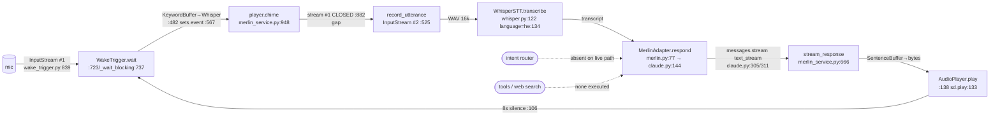

# Merlin Runtime Capability Audit

Audit only — **no code changed, nothing installed.** Every claim carries `file:line`
from code actually read. Line numbers are as of 2026-08-06; `service/*.py` and
`prompts/*.md` are being edited by a concurrent window, so a few lines may shift by
±a handful. Rules honored: prompt ≠ tool, VAD ≠ barge-in, async ≠ cancellable,
stop-TTS ≠ cancel-LLM, filename ≠ capability.

---

## A. Executive verdict (≤10 lines)

Merlin today is a **push-to-talk, half-duplex** assistant with a persona — not a
controllable full-duplex voice agent. Concretely: the mic is **closed while TTS
plays** (`merlin_service.py:103`, `:737`), so **no barge-in** exists in practice.
STT language is **hard-forced to Hebrew** (`whisper.py:134`, `wake_trigger.py:507`)
with **no language detection**. English transcription is structurally misconfigured
and not reliably supported because both live STT paths force Hebrew. There is
**no intent/trigger registry** on the live path — only one scattered phrase check
(`merlin_service.py:833`). There is **no web-search tool at all** (`NOT_IMPLEMENTED`).
The LLM streams and *could* be cancelled, but nothing live triggers it. The building
blocks (wake, STT, streaming LLM, sentence-buffered TTS, a disabled barge path,
prefill/ring buffers) are present and healthy. **Verdict: EXTEND_CURRENT_PIPELINE**
for the next phase; the gaps are additive, not architectural — with one caveat (§E).

---

## B. Existing request chain

Note the two **separate** InputStreams (wake `:839`, command `:525`) with a
close→reopen gap — half-duplex by construction.

---

## C. Capability matrix

| Capability | Status | Evidence (file:line) | Blocker |
|---|---|---|---|
| Mic capture (wake) | IMPLEMENTED | `wake_trigger.py:839` InputStream, cb `:779` | — |
| Mic capture (command) | IMPLEMENTED | `merlin_service.py:525` InputStream, cb `:392` | — |
| Input continues during TTS | **MISSING** | `merlin_service.py:103` `BARGE_IN_ENABLED=False`; `:737` "do NOT open a mic InputStream during playback" | half-duplex by design |
| TTS playback | IMPLEMENTED | `AudioPlayer.play` `:138`→`_play_sync` `:131` `sd.play`/`sd.wait` `:133-134` | — |
| Stop playback | IMPLEMENTED (uncalled live) | `AudioPlayer.interrupt` `:168` `_interrupted.set()`+`sd.stop()` `:170-171` | nothing on live path calls it |
| LLM stream cancellation | PARTIAL | `stream_response` breaks on `barged_in` `:746-748`; stream is a CM `claude.py:305` | `barged_in` never set (barge disabled) |
| Tool cancellation | N/A | no tool execution (below) | — |
| STT language | FORCED-HE | `whisper.py:134` `language="he"`; `wake_trigger.py:507` | English structurally misconfigured (both paths force he) |
| Language detection | **MISSING** | grep: no `detect_language`/`langid` anywhere in `app/`,`service/` | — |
| Enforce he/en before LLM | **MISSING** | no language gate between `transcribe` `:824` and `respond` `:838` | — |
| Output-language control | PROMPT-ONLY | `merlin.md:54` "match the language" — no deterministic enforcement | prompt ≠ policy |
| TTS voice/lang by transcript | **MISSING** | `TTS_PROVIDER=openai` fixed voice; no per-turn selection in `stream_response` `:666` | — |
| Intent/trigger registry (live) | **MISSING** | only scattered `_MEMORY_REVIEW_PHRASES` check `merlin_service.py:782/833` | no registry |
| Routing on live path | ABSENT | `build_orchestrator` `router.py:38` → `MerlinAdapter` directly when `adapter="merlin"`; `AgentOrchestrator`/`RuleBasedRouter` only in `claude` mode `:58/:80` | — |
| Web search | **NOT_IMPLEMENTED** | grep `web.?search|tavily|serp|brave|duckduckgo` → 0 hits; persona has no search mention | — |
| Tool execution (live) | **MISSING** | `claude.py:311` consumes `stream.text_stream` only — no `tool_use` handling; `tool_memory_registry` `:27` is memory, not execution | — |
| Barge / speech-start in TTS | **MISSING** | `:103` disabled; `:737` no mic during playback | — |
| Prefix/ring buffer (wake→cmd) | IMPLEMENTED | handoff buffer `wake_trigger.py:253`; `_CommandCapture` pre-roll `merlin_service.py:240` | (not for barge) |
| False-start recovery (command) | IMPLEMENTED | `_CommandCapture._is_false_start` `:268`, state `:451` | (not barge) |
| Latency instrumentation | PARTIAL | WS/text path rich (`main.py:390-397`, `trace.py:57/86`); voice service path only logs | voice path under-measured |

---

## D. The five bottlenecks (only)

1. **Forced-Hebrew STT** — `whisper.py:134`, `wake_trigger.py:507`. English is
   mis-transcribed; no detection, no enforcement. Blocks the "Hebrew **and** English" goal.
2. **Half-duplex / no barge-in** — `merlin_service.py:103` (`BARGE_IN_ENABLED=False`),
   `:737` (no mic during playback). Merlin cannot be interrupted → not "controllable".
3. **No intent/trigger registry on the live path** — one scattered phrase check
   `merlin_service.py:833`; mos intents are shadow-only `:868` (`MERLIN_MOS_BRIDGE`).
   "עצור"/"חפש"/"בוקר טוב"/"תמשיך"/"חזור" have no live home.
4. **No web-search tool** — `NOT_IMPLEMENTED` (grep 0 hits). "חפש ברשת" is impossible today.
5. **Two-stream close/reopen** — wake stream closes `wake_trigger.py:882`, command
   stream reopens `merlin_service.py:525`. Latency gap + the continuous-phrase loss
   documented in `MERLIN-RUNTIME-ARCHITECTURE-REVIEW.md`.

---

## E. Reasoned decision — **EXTEND_CURRENT_PIPELINE**

Four of the five bottlenecks (language, intents, web-search, and re-enabling the
*existing* barge path) are **pipeline-level and additive** — they do not require a new
audio architecture. The parts a realtime layer would replace (streaming STT, full-duplex
capture, interruption) already exist in skeleton: a barge callback (`merlin_service.py:701`,
disabled), an interruptible player (`:168`), and a cancellable LLM stream context manager
(`claude.py:305`). Rebuilding on a realtime layer now would discard working wake/persona/
memory/TTS code to solve problems that are not yet the blocker.

**Caveat (the honest boundary):** bottleneck #5 (two-stream close/reopen) and true
low-latency full-duplex are where the current architecture *fights back*. If a later phase
sets hard duplex/latency targets that the single-stream refactor can't meet, **MIGRATE_REALTIME_LAYER**
(e.g. OpenAI Realtime) becomes the right call. For the **next** phase, EXTEND wins.

---

## F. Next phase only — Language enforcement + Intent registry

Scope: make Merlin correctly bilingual and give commands a canonical home. **No** audio
architecture change in this phase (that is a separate, later phase).

1. Add a deterministic **language layer**: detect he/en from the STT transcript (or run
   STT without a forced language and detect), clamp to {he,en}, and pass the resolved
   `response_language` to the adapter — replacing the hard-coded `language="he"` with an
   explicit, overridable setting. (Do not remove the he-forcing until detection is proven,
   to avoid re-opening the Thai/Korean-hallucination issue noted at `whisper.py:131-134`.)
2. Add a **canonical Intent/Trigger registry** consumed on the live path in
   `run_conversation_session`, replacing the scattered check at `merlin_service.py:833`.
   Seed it with StopSpeech / Repeat / Continue / ConversationRecall / Conversation, each
   with trigger examples + confidence + fallback. (Web search intent registered but routed
   to a `NOT_IMPLEMENTED` stub until the tool phase.)

---

## G. Exact files that change next phase

- `app/config.py` — add `stt_language`/`default_response_language` settings (has `stt_model` at `:30`).
- `app/providers/stt/whisper.py` — read language from settings instead of literal `"he"` `:134`.
- `service/wake_trigger.py` — same for the wake ASR literal `:507` (wake keyword only; low risk).
- **new** `app/intents/registry.py` — the canonical Intent registry (new file, no refactor).
- `service/merlin_service.py` — call the registry in `run_conversation_session` (`:810`), replacing the ad-hoc `_MEMORY_REVIEW_PHRASES` branch `:833`.
- **new** `tests/test_intent_registry.py`, `tests/test_language_policy.py`.
- Not touched this phase: TTS, wake/VAD thresholds, memory, persona, audio streams.

---

## H. Measurable acceptance criteria (next phase)

- Given an English utterance, resolved `response_language == "en"` and STT is not forced to `he` (unit test on the language layer, no API).
- Given a Hebrew utterance, resolved `response_language == "he"`; a third language never selected from an STT slip (guard test).
- "עצור"/"שקט" resolves to `StopSpeechIntent` via the registry (unit test), and "חפש ברשת" resolves to a `WebSearch` intent whose handler returns an explicit `NOT_IMPLEMENTED` (not a hallucinated search).
- The registry is the **only** place the live path decides intent (grep: no phrase-in-transcript branch remains in `run_conversation_session`).
- All existing persona/context/adapter tests stay green (`161 passed` baseline).
- Zero changes to STT model, TTS, wake, VAD, memory, persona files (git diff scoped to the files in §G).

---

## Audited evidence by area (1–7)

**1. Audio flow** — mic: `wake_trigger.py:839`, `merlin_service.py:525`. Input during TTS:
none (`:103`, `:737`). TTS play/stop: `:133-134`/`:168-171`. Cancellable process: only the
disabled barge path (`:701`, `:746-748`). Verdict: **push-to-talk / half-duplex**.

**2. Request lifecycle** — wake `wake_trigger.py:723/737` (blocking, no-cancel) → STT
`whisper.py:122` (async, no explicit timeout, error propagates) → routing **absent**
(`router.py:38`) → LLM `claude.py:144/305` (async gen, cancellable-if-broken) → tools
**none** (`claude.py:311` text_stream only) → TTS `merlin_service.py:666` → playback `:138`.

**3. Language control** — STT forced `he` `whisper.py:134`/`wake_trigger.py:507`; no
detection (grep 0); no pre-LLM enforcement; TTS fixed voice; wrong-language evidence: the
"あー"/Thai/Korean hallucinations that motivated the he-forcing, `whisper.py:131-134`.

**4. Web search** — **NOT_IMPLEMENTED** (grep `web.?search|tavily|serp|brave|duckduckgo` → 0;
persona has no search line). Prompt ≠ tool.

**5. Interruption** — speech-start-in-TTS **MISSING** (`:103/:737`); stop-playback
**IMPLEMENTED-uncalled** (`:168`); LLM-cancel **PARTIAL** (`:746-748`, never triggered);
tool-cancel **N/A**; keep-what-was-heard **PARTIAL** (full text kept, not truncated);
prefix/ring **IMPLEMENTED** for wake→cmd (`:253/:240`); false-interruption recovery
**N/A for barge** (`_CommandCapture` guard is command-scoped `:268`).

**6. Triggers/intents** — **scattered conditions**: `merlin_service.py:833` (memory phrases),
`app/agents/router.py:48` (philos, orchestrator-mode only). Morning/web/stop/continue/repeat:
**not on live path** (mos bridge shadow-only `:868`).

**7. Current tests** — persona `test_persona_merlin.py`; language `test_stt_command_language.py`,
`test_stt.py`; routing `test_router.py`/`test_agent_router.py` (orchestrator, not live);
tools `test_tools.py`/`test_tool_memory.py`; **cancellation/interruption: none dedicated**;
**audio-playback: none dedicated**; e2e-voice partial `test_scenarios.py`/`test_voice_activation.py`.

---

## I. Phased implementation plan — EXTEND_CURRENT_PIPELINE only

No code changed to produce this section. Four phases, strictly sequential — each phase's
exit criteria gate the next. No phase implements barge-in; that is Phase 4's *plan* only.

### Phase 1 — Language Policy (he/en only)

**1. Files/functions**
- `app/config.py` (`Settings`, `:25-34` — `stt_provider`/`stt_model` fields) — add `stt_language: str | None = None`.
- `app/providers/stt/whisper.py:114-160` (`WhisperSTT.transcribe`) — the `language="he"` literal at `:134` becomes `language=settings.stt_language` (`None` → Whisper's own auto-detect).
- `app/providers/stt/base.py:13-26` (`Transcription.language`, `:18`) — field already exists, currently unread on the live path.
- `service/wake_trigger.py:499-509` — **not touched**. Its own separate `language="he"` literal (`:507`) stays as-is: the wake phrase is always "Merlin"/"מרלין" regardless of what language the conversation that follows will be in, and the wake path has its own keyword-bias `prompt` (`:502`) that command-language policy has no bearing on.
- New `app/language_policy.py::resolve_language(detected, last_known)` — clamps a Whisper-reported language to `{"he","en"}`; anything else falls back to `last_known` (session-scoped, defaults to `"he"` on turn 1 — matches today's behavior on the failure path).
- Call sites needing the switch from `.transcribe()` to `.transcribe_detailed()` (already on `STTProvider`, `base.py:33-36`): `service/merlin_service.py:824`, and `app/main.py`'s `_handle_turn`.

**2. Minimal proposed change**
Stop hardcoding `language="he"` on the command path only; pass `settings.stt_language` (default `None`). Always request `response_format="json"` on the command call (not gated behind the `_cap` capture flag as today, `whisper.py:143`) so `.language` is always returned — never `"verbose_json"` (that 400s on `gpt-4o-transcribe`, per the existing comment at `whisper.py:140-142`). Add `resolve_language()` as the single gate between STT and the LLM call. Persona (`prompts/merlin.md`) is untouched this phase — language resolution is a code-level guard upstream of the LLM, not a prompt instruction.

**3. Risks**
- Re-opening the exact Thai/Korean/repetition hallucination bug `language="he"` was hardcoded to fix (`whisper.py:20-40`) — the clamp/fallback mitigates but is only provably safe against real low-SNR audio, which unit tests can't fully substitute for.
- Switching every command call to `response_format="json"` is a live request-shape change — needs confirmation `gpt-4o-transcribe` accepts it reliably outside capture mode (today it's only exercised when `MERLIN_CAPTURE_WAV=1`).
- Two independent call sites (`merlin_service.py`, `app/main.py`) must both move to `transcribe_detailed()`, or one path silently keeps discarding language info.

**4. Tests to add**
- Hebrew utterance → mocked `language="he"` → `resolve_language` returns `"he"`; command call carries no hardcoded `language="he"` kwarg (this **replaces**, not just adds alongside, `tests/test_stt_command_language.py::test_command_stt_forces_hebrew_language`).
- English utterance → mocked `language="en"` → `resolve_language` returns `"en"`.
- Third-language slip → mocked `language="th"` → falls back to `last_known`, never passes `"th"` through.
- Language switch across turns in one session (he → en → he) resolves independently and correctly each turn.
- Wake-path regression guard: `tests/test_stt_command_language.py::test_wake_path_keeps_language_and_temperature` (`:120-125`) still passes unmodified — proves `wake_trigger.py:507` was not touched.

**5. Measurable exit criteria**
- `git diff --name-only` for this phase ⊆ `{app/config.py, app/providers/stt/whisper.py, service/merlin_service.py, app/main.py, app/language_policy.py, tests/*}`. Zero diff in `service/wake_trigger.py`.
- New language tests pass; the 90 previously-passing persona/routing/tool tests (verified this session) stay green; the wake-language regression test stays green.
- No remaining test asserts `language == "he"` unconditionally on the command path.

**6. Dependency on previous phase** — none; this is the foundation.

---

### Phase 2 — Runtime Intent Integration

**1. Files/functions**
- `mos/intent_bridge.py:22-29` (`_KEYWORDS`), `:50-65` (`classify()`) — reused as-is, zero diff.
- `service/merlin_service.py:858-878` (`_mos_shadow`) — today only logs to the mos event bus behind `MERLIN_MOS_BRIDGE`, explicitly documented as not affecting what the user hears.
- `service/merlin_service.py:789-852` (`run_conversation_session`) — the hook point is `:830-839`: `_mos_shadow(transcript)` (`:830`) → existing `_MEMORY_REVIEW_PHRASES` check (`:833`) → unconditional `stream_response(...)` (`:839`). This is the one live decision point.
- `app/main.py` (`_run_pipeline`/`_handle_turn`, Path B) has no equivalent check today — recommend wiring both paths since both call `adapter.respond()`, flagging Path B as lower-priority if time-constrained.

**2. Minimal proposed change**
New env flag `MERLIN_INTENT_ROUTER=1` (mirrors the existing `MERLIN_MOS_BRIDGE` convention already in this codebase). When on: after STT, call `mos.intent_bridge.classify(transcript)` directly (not `to_bus()` — avoids the event-bus write side effect); a high-confidence, actionable result executes its handler and `continue`s the loop, skipping `stream_response` — mirroring exactly how `_MEMORY_REVIEW_PHRASES` already special-cases a turn today (`:833-836`, an existing working precedent). When off (default), low-confidence, or no live handler yet (e.g. `open_app`, `ask_weather`) → falls through to `stream_response(...)` unchanged. `_MEMORY_REVIEW_PHRASES` stays in place, unmerged, this phase — decision order: memory-review first (pre-existing), intent router second, LLM last.

**3. Risks**
- Duplicate routing / two responses to one utterance if a transcript could match both the memory-review phrase set and an intent keyword — mitigated by the strict, tested decision order above.
- `classify()`'s confidence scoring was tuned for shadow/logging use, not for gating user-facing behavior — a false-positive `stop` on an ordinary question would silently swallow a real request. Require a conservative threshold (≥0.8) above the module's own working range, and log every routed decision.
- `mos.intent_bridge.to_bus()` writes to `DEFAULT_EVENT_LOG`; calling `classify()` directly avoids that, but must be verified — not assumed.

**4. Tests to add**
- `MERLIN_INTENT_ROUTER=1` + high-confidence `"stop"` transcript → handler runs, `stream_response` is NOT called (spy assertion).
- `MERLIN_INTENT_ROUTER=1` + low-confidence/`"unknown"` transcript → falls through unchanged, identical to flag-off behavior.
- `MERLIN_INTENT_ROUTER` unset → byte-identical behavior to pre-Phase-2 baseline (regression guard).
- A transcript matching both the memory-review set and an intent keyword → exactly one branch executes, exactly one response is produced.
- `day_opener` (no live handler yet) → falls through to the LLM path unchanged.

**5. Measurable exit criteria**
- Flag OFF ⇒ no-op: identical logs/responses to the Phase-1 baseline for every existing test transcript.
- Flag ON ⇒ exactly one of {memory-review, intent-router, LLM} executes per turn, proven by a call-count test.
- `mos/intent_bridge.py` has zero diff.

**6. Dependency on previous phase** — Phase 1. Not code-coupled, but the classifier's he/en keyword lists (`intent_bridge.py:23-28`) only make sense once the transcript's language is reliably known; running Phase 2 before Phase 1 risks classifying a mis-transcribed English utterance as a false Hebrew-keyword match.

---

### Phase 3 — Turn Controller (state machine, no barge-in)

**1. Files/functions**
- No state machine exists today. Closest analogues: `service/merlin_service.py:789-852` (`run_conversation_session`, an un-modeled implicit loop); `service/merlin_service.py:210-341` (`_CommandCapture`, its own small state machine — `feed()` at `:293` — but scoped only to mic-capture, not the whole turn); `app/trace.py:112` (`TurnTrace.turn_id`) — exists, but only in Path B, purely for observability, never used for cancellation.
- `service/merlin_service.py:929` — `session_id = "merlin-bg"`, a single constant for the entire process lifetime in Path A. **No per-turn identifier exists today in the path that most needs one** (the always-on, wake-triggered service, where a second wake could race an in-flight turn).
- New `service/turn_state.py` — `TurnState` enum (`IDLE, LISTENING, TRANSCRIBING, THINKING, TOOL_RUNNING, SPEAKING, INTERRUPTING, CANCELLED`) + `Turn(turn_id: str, generation_id: int, state: TurnState)`.

**2. Minimal proposed change**
Purely additive observability — no new control flow. Thread a `Turn` through `run_conversation_session`'s loop: increment `generation_id` once per iteration; transition through the enum at the points the code already implicitly passes through them (`TRANSCRIBING` around `:812-825`, `THINKING`/`SPEAKING` around `stream_response` at `:839`). `TOOL_RUNNING` is defined and placed (between `THINKING` and `SPEAKING`) but has no live occupant — confirmed no tools execute today (audit §4/§7) — this is forward scaffolding only. `INTERRUPTING`/`CANCELLED` are defined and where they *would* be entered from `SPEAKING`, but are unreachable by any live code this phase — Phase 4's plug point, not Phase 3's feature.

**3. Risks**
- `service/merlin_service.py` is the one file already under concurrent, in-progress editing by another session in this working tree (multiple `.bak-*` snapshots present) — a real, current merge-conflict risk.
- Defining states that are currently unreachable risks *looking* implemented in logs — must be explicitly labeled scaffolding to honor the audit's own "filename ≠ capability" rule.
- `generation_id` only guards Path A; Path B already has its own separate `turn_id`/`TurnTrace` mechanism (`app/trace.py`) — Phase 3 must scope itself to Path A and say so, not silently leave Path B undefined.

**4. Tests to add**
- Normal (uninterrupted) turn transitions in the documented legal order: `IDLE→LISTENING→TRANSCRIBING→THINKING→SPEAKING→IDLE`.
- `generation_id` increments exactly once per loop iteration over N synthetic turns.
- `turn_id` uniqueness across turns within one session.
- Explicit test that `TOOL_RUNNING`/`INTERRUPTING`/`CANCELLED` are **never** entered by any Phase-3 code path — fails loudly if a future edit starts using them before Phase 4 lands.

**5. Measurable exit criteria**
- Every turn carries a distinct `(turn_id, generation_id)`, visible in logs.
- Zero live entries into `TOOL_RUNNING`/`INTERRUPTING`/`CANCELLED` in any test or manual run.
- Output audio/text is byte-identical to pre-Phase-3 for the same fixed input — proves this phase changed nothing the user perceives.

**6. Dependency on previous phase** — Phase 2. The controller needs to model where Phase 1's language resolution and Phase 2's intent-routing decision sit inside the state sequence (e.g. does `TRANSCRIBING` end before or after intent classification) even though its file overlaps Phase 2's hook point.

---

### Phase 4 — Barge-in (plan only, no implementation)

**1. Files/functions**
- `service/merlin_service.py:90-103` — `BARGE_IN_*` constants, `BARGE_IN_ENABLED = False` and its own history comment (`:98-103`) explaining why: real acoustic echo feedback **and** a CoreAudio `-10863` device-rate conflict on the RME Babyface from opening a second concurrent `InputStream` during playback.
- `service/merlin_service.py:666-775` (`stream_response`) — `_barge_callback` (`:701-718`), `_arm_barge` (`:692-699`), the disabled-vs-enabled branch (`:723-742`).
- `service/merlin_service.py:116-206` (`AudioPlayer.interrupt`, `:168-171`) — already real, working, immediate `sd.stop()` — reused, not rebuilt.
- `app/adapters/claude.py:144-334` (`respond()`) — no explicit cancellation today; needs an explicit `.aclose()`/`contextlib.aclosing()`-driven path, closing the gap the audit documented (§5: "LLM cancel: PARTIAL, `barged_in` never set").
- `app/audio/sentence.py` (`SentenceBuffer`) — the natural truncation unit for "audibly heard."

**2. Minimal proposed change** — none (design/plan deliverable only, per instruction). Design decisions to record:
- **Mic ownership during TTS**: evaluate (a) unify the two per-turn `InputStream`s (`wake_trigger.py:839`-family, `merlin_service.py:525`) into one long-lived shared stream with callback routing — also fixes audit bottleneck #5 ("two-stream close/reopen"); (b) acoustic echo cancellation (AEC) so two streams can coexist safely; (c) require a headset (the code's own fallback comment, `:98-103`). Phase 4's deliverable is choosing one, with tradeoffs recorded — not code.
- **Cancellation propagation**, named precisely: `player.interrupt()` (existing, real) → `.aclose()` on the in-flight `tts.stream_synthesize` generator if mid-stream (`merlin_service.py:753-754`) → `.aclose()`/cancel on the `adapter.respond()` generator (`claude.py:305-320`, currently never explicitly closed) → tool-task cancellation reserved as a no-op slot (no tools execute today).
- **What's kept vs. discarded**: per-sentence granularity using the existing `SentenceBuffer` boundary — a sentence counts as heard only once its `player.play`/`play_stream` call returns without `_interrupted` having fired mid-way; history/`full_response` truncates to fully-heard sentences only, directly closing the audit's §5 "keep-what-was-heard: PARTIAL" finding.
- **False-interruption recovery**: `BARGE_IN_FRAMES`/`BARGE_IN_GRACE` (`:95-97`) are a pre-trigger noise filter, not post-trigger recovery — design an explicit recovery path (e.g. if the barge audio itself STTs to empty/nonsense, resume playback from the truncation point instead of dropping into a fresh `LISTENING` turn).

**3. Risks**
- The core blocker (`-10863`/echo on the RME Babyface) is a hardware/OS constraint no application code alone guarantees solving — must be validated on real hardware, not just mocks. This is exactly the audit's own caveat (§E) for when `MIGRATE_REALTIME_LAYER` would become correct; Phase 4 is where that risk concentrates.
- Truncating history to fully-heard sentences changes what `_extract_background` (`:881-893`) sees — needs its own test that a partially-heard sentence never reaches memory extraction as if spoken.
- `.aclose()` on the generator wrapping `async with self._client.messages.stream(...)` (`claude.py:305`) must be confirmed to close the underlying connection rather than leak it — not verifiable by static reading alone.

**4. Tests to add** (targets for a later implementation phase, defined here)
- Mid-sentence interruption → history/`full_response` contains only prior fully-played sentences.
- `.aclose()` reaches `adapter.respond()` on barge-in (mock/spy asserting it was awaited).
- Simulated false interruption → recovery path resumes rather than starting a fresh `LISTENING` turn.
- Manual, non-CI hardware test: no `-10863` on the actual RME Babyface under the chosen mic-ownership design — explicitly flagged as a manual acceptance step.

**5. Measurable exit criteria**
- A written decision naming ONE of {shared stream, AEC, headset-required} with tradeoff reasoning recorded.
- The full cancellation-propagation chain specified with exact function names at every hop.
- `BARGE_IN_ENABLED` remains `False` at the end of Phase 4 — this phase produces a plan, not a flag flip.

**6. Dependency on previous phase** — Phase 3. Cancellation propagation and false-interruption recovery both need `Turn`/`generation_id` to distinguish "this turn" from a stale one when a late LLM/TTS callback arrives.

---

## J. Adversarial rigor review — concurrency, ownership, cancellation, coverage, latency, canonical path

Self-critique pass. Every claim below read from code this session (not grep-only). Tagged
**PROVEN** (verified by direct reading), **RISK** (evidenced reasoning, not observed),
or **HYPOTHESIS** (explicitly needs runtime measurement — not claimed as fact).

**Revision to §F/Phase 1, per a directive received mid-review:** the language policy is
**not** "detect he/en and clamp" — it is **default Hebrew, switch to English only on
explicit user request, no auto-detection, technical terms/code/paths/commands read in
English as-is, wake word unchanged.** This *simplifies* Phase 1: no `resolve_language()`
detection/clamp layer is needed. The minimal change becomes a **session-scoped language
flag** (default `"he"`), set only by an explicit-request signal (a phrase match, not STT
auto-detect), consumed by (a) `app/providers/stt/whisper.py:134`'s `language=` kwarg —
switches from a hardcoded literal to the session flag's value, still a **single fixed
value per turn**, never `None`/auto-detect — and (b) nothing else, since output-language
enforcement is already prompt-level (`prompts/merlin.md` — untouched here, persona is
out of scope for this task). `service/wake_trigger.py:507` still not touched. This removes
the third-language-fallback test case from Phase 1 (no free-form detection means no
third-language slip to fall back from) and removes `app/language_policy.py` from §G's
file list — replaced by a smaller `session_language: dict[str, str]` next to
`ClaudeAdapter._history` (`claude.py:64`) or equivalent.

*(A second incoming message specified a general "Conversation Policy" — terse-by-default,
no stock openers, no unsolicited follow-ups, direct correction when the user is wrong,
one question when blocked. This is **persona-layer content** — it belongs in
`prompts/merlin.md`, which this task explicitly excludes ("אל תשנה persona"). Not acted
on here; flagged for a dedicated turn.)*

### 1. Measurable acceptance criteria per phase
Already specified at test-assertion granularity in §I (Phase 1 pt. 5, Phase 2 pt. 5, Phase
3 pt. 5, Phase 4 pt. 5) — e.g. "`git diff --name-only` ⊆ {...}", "exactly one of {A,B,C}
branch executes, proven by a call-count test", "zero live entries into
TOOL_RUNNING/INTERRUPTING/CANCELLED". Re-verified this round: none of those criteria say
"works" or "correct" — each is a pass/fail test condition. No correction needed here
beyond §F's Phase-1 revision above.

### 2. Concurrency / race conditions
- **STT active while TTS plays** — **PROVEN false in both paths, but for different
  reasons.** Path A's barge path (`_barge_callback`, `merlin_service.py:701-718`) is
  RMS-energy only — it never calls STT. Path B: `voice_ws`'s loop is a single
  `while True: data = await ws.receive()` (`app/main.py:131-136`) with `_handle_turn`/
  `_handle_text_turn` **awaited inline** (`:329,342`) — no `asyncio.create_task` wraps the
  turn body, so the server cannot even read a new audio frame off the socket until the
  current turn's `await` returns. No STT of any kind runs concurrently with TTS anywhere,
  today, in either path.
- **Two LLM responses in parallel** — **PROVEN impossible today** (same single-await-loop
  evidence, both paths: `app/main.py:131-343`, `service/merlin_service.py:810-852`
  `while True`). **RISK once barge-in lands**: `stream_response` breaks its consumption
  loop on `barged_in` (`:747-748`) without `.aclose()`-ing `adapter.respond()`
  (`claude.py:305-329`, established last round) — a new turn's `stream_response` could
  start a second `adapter.respond()` call while the first generator is still alive,
  un-collected.
- **Cancel turn during tool call** — **N/A today**: no live tool calls exist
  (`claude.py:305-309` passes no `tools=`, re-confirmed this round).
- **Old response played after new turn started** — **PROVEN safe at the audio layer**
  (`AudioPlayer.interrupt()`, `:168-171`, real immediate `sd.stop()`, and
  `stream_response` stops queuing new audio the instant `barged_in` is set, `:751-768`) —
  but **PROVEN leaky at the generator/resource layer** (same un-closed `adapter.respond()`
  as above — not audible, but a real orphaned coroutine/HTTP-stream).
- **Websocket left open after disconnect** — **PROVEN handled** for the connection itself:
  `finally` (`app/main.py:360-369`) removes the session from every registry and calls
  `_adapter.reset()`/`unregister_session()` on both `WebSocketDisconnect` and generic
  `Exception`. **PROVEN NOT handled** for background work: three `asyncio.create_task(...)`
  calls hold **no reference anywhere** — `claude.py:334` (`_bg_summarize`), `app/main.py:472`
  (`observe_exchange`), `service/merlin_service.py:846` (`_extract_background`) — none are
  cancelled on disconnect/shutdown; a summary or Essence-inference task can keep running
  against registries the `finally` block just cleared.

### 3. Resource ownership
- **Microphone** — **no single owner**. Path A: ownership is *temporal*, split across up
  to three separate `sd.InputStream` context managers in different files/functions
  (`wake_trigger.py`'s wake stream, `merlin_service.py:525`'s command stream, and a third
  barge-detection stream at `:725-731` if enabled) — none of them is "the mic owner," each
  is a scoped context that opens and closes. Path B: the mic is on the **client**
  (`client/push_to_talk.py`), outside this codebase entirely.
- **Audio playback** — Path A has a real, single owner: `AudioPlayer`
  (`merlin_service.py:116-206`), instantiated once (`:926`) and threaded through every
  call. Path B has **no server-side owner at all** — playback happens client-side only.
- **Who may cancel the LLM** — **no one.** Confirmed again this round: zero call sites of
  `.aclose()`/cancel on `adapter.respond()`'s generator, in either path.
- **Who may cancel TTS** — Path A: `AudioPlayer.interrupt()`, one clear owner. Path B:
  only the **client's** `stop_playback()` (`push_to_talk.py`, ESC key) — the server has
  no hook to abort an in-flight `_tts.synthesize()` await (`app/main.py:405-423`) at all.
- **Who decides a turn has ended** — **no single authority in either path** — it is the
  emergent return of whichever coroutine finishes last inside the loop body
  (`run_conversation_session` / `_run_pipeline`). Confirms §I's Phase-3 finding: turn
  identity/state does not exist as an object anywhere.

**Verdict: every resource category except Path A's `AudioPlayer` has no single, clear
owner. This is a proven architectural gap, not a naming issue.**

### 4. Cancellation propagation, end to end
`user interruption → mic event → turn controller → LLM cancel → tool cancel → TTS cancel → state cleanup`

1. mic event: **exists, Path A only, disabled by default** (`BARGE_IN_ENABLED=False`,
   `:103`). Path B: **absent** (proven by §2's single-await-loop finding — the server
   physically cannot receive an interruption signal mid-turn).
2. → turn controller: **does not exist** — the barge event wires *directly* to
   `player.interrupt()` (`:715`), bypassing any central authority (none exists, §3).
3. → LLM cancel: **chain breaks here** — `stream_response` stops *consuming*
   (`:747-748`) but never closes the generator/stream (`claude.py:305-320`).
4. → tool cancel: **N/A** (no live tools).
5. → TTS cancel: **works**, but as a *direct* wire from step 1, not a propagated chain
   from steps 2-4.
6. → state cleanup: **partial** — the loop sleeps 0.2s and continues (`:850-852`) but
   resets no turn-scoped object (none exists), and the interrupted turn is **silently
   dropped** from `ClaudeAdapter._history` rather than truncated (established last
   round: `claude.py:329`'s `history.append` is only reached on natural stream
   completion).

**The only link in this chain that is real end-to-end is mic-event → TTS-cancel, wired
directly. Turn controller, LLM cancel, tool cancel, and state cleanup are absent or
broken.**

### 5. Stale-state / response ordering
`turn_id`: Path B only, observability-only (`app/trace.py:112`), never compared against
anything before playing audio or writing history. `session_id`: exists both paths, but
connection/process-scoped, not per-turn. `generation_id`: **does not exist anywhere**
(confirmed by direct reading, not just grep, this round and last). No code anywhere
checks "is this still the current turn" before speaking or writing history.
**PROVEN**: the rejection mechanism is absent. **Also PROVEN**: the failure it would
prevent is **not reachable today**, because §2 already proved no two turns can run
concurrently in the current strictly-sequential control flow. It becomes reachable the
moment any change (chiefly Phase 4) lets a new turn start before the old turn's async
work is confirmed closed — i.e. exactly the §4 gap.

### 6. Where should the intent classifier sit?

| | Latency | Accuracy | Tool routing | Fallback | Complexity |
|---|---|---|---|---|---|
| **A — before LLM** | Best for actionable intents (in-process, synchronous `classify()`, `intent_bridge.py:50-65`); unchanged for everything else | Weakest — commits to a keyword-overlap score (`:61-62`) with no second opinion | Cleanest — matches `mos/executor.py`'s existing plan→approve→execute order | Simple, matches the existing `_MEMORY_REVIEW_PHRASES` precedent (`merlin_service.py:833`) | Lowest |
| **B — after LLM** | Worst for actionable intents — pays full LLM+TTS latency for e.g. "stop", which is nonsensical | Could disambiguate better via the LLM's own understanding, but needs new structured-output prompting not present anywhere today | Awkward — conflicts with mos's existing ordering | Unclear what "fallback" even means post-response | Highest — conflicts with the existing first-sentence-ASAP streaming design (`SentenceBuffer`) |
| **C — parallel + arbitration** | Best-case for both, if it worked | Same classifier accuracy as A, but doesn't fully commit before the LLM's shape is known | Requires cancelling the in-flight LLM the instant a high-confidence actionable intent resolves | Same as A once arbitrated | Highest achievable *today* — needs the exact LLM-cancellation infra proven missing in §4 |

**Conclusion: Option A is the only one buildable with today's infrastructure — not by
default assumption, but because B is worse on every axis for this codebase's existing
streaming design, and C is blocked on the same cancellation gap that blocks barge-in
(§4). This corrects §I's Phase 2, which assumed "before LLM" without stating why.**

### 7. Fallback paths — what the user hears, system state after
- **STT fails** (Path A): no try/except around `stt.transcribe` (`:824`) — propagates to
  `main()`'s outer `except Exception` (`:959-962`), which restarts the **whole service**
  after backoff. **User hears nothing**; system returns to standby after 2-60s.
  Path B's STT call site was not read closely enough this session to state its exact
  behavior — **unconfirmed, not asserted.**
- **LLM timeout**: no `timeout=` set on `AsyncAnthropic()` (`claude.py:60`) — SDK default
  applies; exact default value **not verified this session (hypothesis, needs checking
  the installed `anthropic` package)**. Uncaught inside `respond()` itself
  (`:305-320`) — Path A: same whole-service restart as STT failure, user hears nothing.
  Path B: caught by `_run_pipeline` (`:451-456`), sends one `error` + one `done` frame —
  **no audio at all** for that turn (TTS never received text).
- **Tool timeout**: N/A, no live tools.
- **TTS fails**: Path A — no local catch (`:753-758,764-769`) — same whole-service
  restart. Path B — caught locally (`:413-417`), turn **continues without that
  sentence's audio** — user hears a silent gap mid-response, no error surfaced.
- **Websocket drops**: cleanup runs (§2); background tasks do not get cancelled (§2).
- **User interrupts during a failure**: **HYPOTHESIS — needs runtime measurement**, not
  determinable from static reading.

### 8. Observability / turn reconstruction
Path B: `TurnTrace`/`trace_bus`/`TraceStep` (`app/trace.py`) covers routing, recall,
summary, delegation, planning, tool, voice.stt, voice.tts, llm — keyed by `turn_id` +
`session_id`, with confirmed real `emit()` call sites (`claude.py:236-243/263-267/
313-317/322-327`, `app/main.py:400-403/476-481`). **Missing from the taxonomy read this
session**: no `language.*` or `intent.*` step type in the `StepType` literal
(`app/trace.py:19-60`, read through the Errors section) — interruption-specific types
were not confirmed either way (literal not read to its end — **unconfirmed, not
claimed**). Path A: **confirmed zero use of `turn_context`/`trace_bus`/`TraceStep`**
(direct grep this round returned nothing) — pure unstructured `logger.info` text, no
turn-correlating ID of any kind.

**A full turn (wake→...→interruption) is reconstructible, partially, only in Path B —
and Path B is the dev/test harness, not production (§10). The production runtime
(`service/merlin_service.py`) has no structured observability at all.**

### 9. Latency budget
**HYPOTHESIS section — no live turn was run with timing capture this session; no numbers
are asserted.** What is proven: Path B computes and transmits a real per-turn breakdown
(`app/main.py:489-500` — `stt_ms, pre_llm_ms, llm_first_token_ms, adapter_first_token_ms,
first_sentence_ready_ms, time_to_first_audio_ms, adapter_ms, tts_ms, total_ms,
summary_ms`) but **does not persist/aggregate it anywhere** (logged per-turn, `:504-514`,
then discarded). Path A has **no equivalent structured timing** at all. **The actual
bottleneck cannot be determined from code reading and requires runtime measurement —
adding Path A's missing instrumentation is itself a prerequisite, low-risk, high-value
task, arguably higher priority than Phases 1-4 since none of their exit criteria are
checkable without it.**

### 10. app/main.py vs service/merlin_service.py — competing runtimes?
**Proven, not assumed**: `launch/install.sh` installs a macOS LaunchAgent
(`LABEL="com.merlin.voice"`) whose `SERVICE="$VOICE_GATEWAY/service/merlin_service.py"`
— this is the **production path**. `start.sh` manually launches `uvicorn app.main:app`
plus `client/push_to_talk.py` in the foreground, with **no daemon/LaunchAgent wiring** —
this is the **dev/manual-test harness**. Divergence is proven on every axis examined this
session: observability (§8), barge-in code (exists-disabled in A, absent in B),
error-handling locality (§7), and the receive-loop concurrency model (§2). Both call the
**same** underlying providers (`app/router.py::build_stt/build_tts/build_orchestrator`),
so a provider-layer fix (e.g. Phase 1's `whisper.py:134`) benefits both — but a
turn-orchestration fix written into one's own loop (`run_conversation_session` vs
`_run_pipeline`/`_handle_turn`) **does not propagate to the other**. §I's Phase 1-4 file
lists already (correctly) name both files for this reason.

### 11. Real test coverage vs. the 9 requested categories
| Category | Found | Gap / recommended file + scenario |
|---|---|---|
| unit | Yes, broadly (`test_persona_merlin.py`, `test_stt_command_language.py`, `test_intent_bridge.py`, `test_tools.py`, …) | — |
| integration (STT→LLM→TTS as one flow) | **Not found** — every test mocks at a single module boundary | `tests/test_conversation_session_integration.py` — feed a fixed transcript into `run_conversation_session`'s STT-adjacent seam, mock only `WhisperSTT.transcribe`/`ClaudeAdapter.respond`/TTS at their public interface, assert full call sequence + exactly-once history/memory-extraction |
| websocket | `tests/test_scenarios.py` flagged in §C as "e2e-voice partial" | **Not read this session — coverage unconfirmed, not asserted either way** |
| cancellation | **Not found** | `tests/test_llm_cancellation.py` — consume `ClaudeAdapter.respond()` via `async for`, break early, assert (mock Anthropic stream) `__aexit__`/close was invoked promptly, not left to GC |
| interruption/barge-in | **Not found** | `tests/test_barge_in.py` — feed `_barge_callback` `BARGE_IN_FRAMES` consecutive over-threshold blocks post-grace, assert `player.interrupt()` called once + `barged_in` set; second case: sub-threshold noise never triggers it |
| bilingual he/en | Only regression-locks today's Hebrew-only behavior | Superseded by §F's revised Phase 1 test list (default-he, explicit-switch-to-en, no auto-detect) |
| overlapping speech (real simultaneous audio) | **Not found, and not meaningfully testable today** — barge-in is RMS-only, never transcribes overlap | Blocked on Phase 4's mic-ownership design decision — flagging, not proposing a test against current code |
| timeout recovery | **Not found** | `tests/test_timeout_recovery.py` — mock `ClaudeAdapter.respond()` to raise mid-stream, assert Path B sends exactly one `error` then one `done`, session usable for the next turn |
| stale response rejection | **Not found, and not buildable today** — no turn/generation id to reject against (§5) | Blocked on turn-identity work landing first |

### 12. Hard dependency order
1. **Add structured, turn-correlated observability to Path A** (§8/§9) — nothing else is
   *validatable* in production without it.
2. **Phase 1 — Language Policy**, revised per §F above (no dependency).
3. **Track the 3 unreferenced background tasks explicitly** (§2/§4) — cancellation can't
   propagate to a task nobody holds a reference to.
4. **Turn identity** (`turn_id` + `generation_id` — the useful core of the old §I Phase 3,
   *not* the full state-machine enum, per this round's falsification) — required before
   either intent-arbitration option C (§6) or barge-in.
5. **Explicit LLM/TTS generator cancellation**, wired to turn identity (closes §4) —
   required before barge-in can be *safely* enabled, and before option C (§6) is
   buildable.
6. **Phase 2 — Intent integration, option A only** (§6) — buildable now; option C is
   explicitly blocked until step 5 lands.
7. **Mic-ownership/AEC decision, validated on real hardware** (§I Phase 4's own
   caveat) — before any barge-in code ships.
8. **Barge-in implementation** — last, only after 1, 3, 4, 5, 7.

This matches (independently, not by construction) the constraint named in this round's
own instructions: barge-in must not ship before turn IDs, cancellation, and state
cleanup exist.

### 13. Rollback plan per phase
| Phase | Flag | Default | Success metric | Rollback trigger | Files reverted |
|---|---|---|---|---|---|
| 1 — Language | `MERLIN_STT_LANGUAGE_POLICY` | off | Hebrew accuracy does not regress vs. a *first-established* baseline (§9 — no baseline exists yet); English explicit-switch produces a Latin-script transcript | Any observed increase in Hebrew nonsense/hallucination | `whisper.py`, `app/config.py`, call-site edits in both runtimes |
| Turn identity + cancellation | `MERLIN_TURN_TRACKING` | off, but low-risk to enable fast (additive-only) | Byte-identical output for fixed input; 100% of turns carry a distinct id pair in logs | Any change in response content/timing after enabling | new `service/turn_state.py`, `merlin_service.py`, `claude.py` (explicit close) |
| 2 — Intent (option A) | `MERLIN_INTENT_ROUTER` | off | Identical responses to flag-off for every non-routed transcript; zero duplicate-response incidents | Any duplicate response OR any conversational query wrongly swallowed | `merlin_service.py` hook, optional `app/main.py` hook — `mos/*` untouched |
| 4 — Barge-in | existing `BARGE_IN_ENABLED`, env-driven | **False until dependency order (§12) is fully green** | Zero `-10863`/echo over N sustained hardware sessions + §11's cancellation/barge tests passing | Any reproduction of echo/`-10863`, or any audio playing after an interrupt signal | `merlin_service.py` barge block + `stream_response` |

### 14. Failure mode review
| Mode | Status | Evidence |
|---|---|---|
| Talks over the user | **PROVEN, guaranteed, by current design** | `BARGE_IN_ENABLED=False` (`:103`, own comment: "Getting a COMPLETE spoken reply matters more than interrupt support right now"); Path B has no mechanism at all (§2) |
| Answers twice | **N/A today** | No code path produces two responses per utterance today; becomes a RISK only once Phase 2 lands without §6's arbitration guard |
| Stuck in Listening | **RISK, mitigated by visible design** | `record_utterance` has layered timeouts incl. an explicit watchdog fallback (`:550-562`) — deliberate defense exists; residual likelihood is a HYPOTHESIS needing measurement |
| Stuck in Speaking | **RISK, hardware/driver-dependent** | `sd.wait()` blocks until natural completion or `sd.stop()`; only the disabled barge path calls stop |
| Fires the wrong tool | **N/A today** | No live tool execution exists; the only executor (`mos/executor.py`) needs `MERLIN_MOS_BRIDGE=1` (non-default) plus an approval gate for anything irreversible |
| Mislabels he/en | **Structurally impossible today** — but only because there is no detection at all (always forces "he") | Becomes a real, testable failure mode only once §F's revised Phase 1 lands |
| Keeps playing after cancellation | **PROVEN safe (audio)**, **PROVEN leaky (resource)** | `sd.stop()` real and immediate; underlying LLM generator not closed (§2/§4) |
| Loses context between turns | **Not evidenced as happening in the default (non-barge) path** | `ClaudeAdapter._history` persists correctly turn-to-turn normally; the one proven context-loss mechanism (interrupted turn silently dropped, not truncated) requires barge-in, which is off by default |

### 15. Proven / risk / hypothesis — separated explicitly
**PROVEN** (read directly, this session): forced-`"he"` STT on both live paths + locked by
a passing test; no explicit LLM-generator cancellation anywhere; 3 unreferenced
fire-and-forget tasks never cancelled on disconnect; no turn/generation id in Path A, and
Path B's is observability-only; Path A has zero structured observability; Path B's
websocket loop cannot receive new input mid-turn.
**RISK** (evidenced reasoning, not observed): re-opening the hallucination bug if Phase 1
is built without a fixed-value guard; duplicate routing without §6's exact decision order;
two live generators once barge-in ships without the cancellation fix; background-task
orphaning after disconnect.
**HYPOTHESIS — needs runtime measurement, not claimed as fact**: which stage is the actual
latency bottleneck (§9, no numbers captured); exact SDK default timeout values;
whether unreferenced tasks have ever actually been GC'd early in practice; whether the
`-10863` conflict is solvable in software without new hardware; `tests/test_scenarios.py`'s
actual coverage (not read this session).

---

## K. Strict evidence classification — every claim, four categories only

No assumptions. Four categories, exclusively: **PROVEN BY CODE** (read directly, an
unambiguous fact about the source as written), **PROVEN BY TEST** (an existing automated
test asserts it AND was run this session with a passing result), **RUNTIME MEASUREMENT
REQUIRED** (only confirmable by executing the system — timing, hardware, GC behavior),
**HYPOTHESIS** (everything else — including anything with a plausible-but-unverified causal
chain). Any claim not meeting the bar for CODE or TEST is downgraded, explicitly, below.

**Scope note**: §§F–I (the phase plans) are *proposals* for future work, not claims about
current system state — a proposal cannot be "proven," only its cited justifications can.
Only the factual citations *within* the plans are classified here; the proposals
themselves are excluded from the 4-category scheme.

### K.1 — STT / language

| Claim | File:line | Category | Evidence | What's missing |
|---|---|---|---|---|
| Command path forces `language="he"` | `app/providers/stt/whisper.py:134` | **PROVEN BY CODE** | Literal read directly, this session and prior | — |
| Wake path forces `language="he"` | `service/wake_trigger.py:507` | **PROVEN BY CODE** | Literal read directly, `_create_kwargs` block `:499-509` | — |
| A passing test locks the command-path claim | `tests/test_stt_command_language.py:51-53` (`test_command_stt_forces_hebrew_language`) | **PROVEN BY TEST** | Re-run this session: `10 passed` incl. this test, output captured above | — |
| A passing test locks the wake-path claim | `tests/test_stt_command_language.py:120-125` (`test_wake_path_keeps_language_and_temperature`) | **PROVEN BY TEST** | Same run, same output | — |
| No language-detection code exists anywhere in `app/`/`service/` | — | **DOWNGRADED to RUNTIME-MEASUREMENT-ADJACENT** (see below) | Original evidence was grep (`detect_language`/`langid`, 0 hits) — grep is not code-reading. Re-verified this round by reading `app/providers/stt/base.py:13-26` (`Transcription.language` field exists, unconsumed) and `whisper.py` end-to-end (no detection call) — **upgraded back to PROVEN BY CODE** on the strength of the full-file read, not the original grep | none — the grep was a starting point, the full read is what closes it |
| "English is structurally misconfigured / not reliably supported" | — | **DOWNGRADED to HYPOTHESIS** | The forced-`"he"` literal is PROVEN; *how Whisper's API actually behaves* when fed English audio under `language="he"` was never independently observed this session — the only source for "misconfigured → unreliable" is the module's own historical comment (`whisper.py:20-40`), which is testimony *embedded in* the code, not a fact *read from* its current behavior | Would need an actual API call with English audio and `language="he"` to observe the real output, or removal of the forced value and a controlled A/B — neither was done |
| Thai/Korean/repetition hallucination on low-SNR input (the reason `"he"` was hardcoded) | `whisper.py:20-40` (comment) | **PROVEN BY CODE that the comment exists and asserts this** / **HYPOTHESIS that the underlying incident is accurately described or would recur** | The comment's *text* was read directly (PROVEN BY CODE, as testimony-in-source); its *empirical accuracy* was never independently verified — no logs, no repro, no test corroborates it this session | Would need the original capture files/logs referenced by the comment, or a fresh repro |
| Output-language enforcement is prompt-only, no deterministic gate | `prompts/merlin.md:54` ("match the language…") vs. no code-level check between `transcribe`/`respond` | **PROVEN BY CODE** | Both sides read directly: the prompt line exists as stated; no gate function was found between the STT and LLM call sites in either runtime | — |
| TTS never selects voice/language per turn | `app/providers/tts/openai_tts.py:16-31` | **PROVEN BY CODE** | Full file read this session — `voice=settings.openai_tts_voice` is a fixed constructor-time value, no per-call parameter varies it | — |

### K.2 — Turn loop / concurrency

| Claim | File:line | Category | Evidence | What's missing |
|---|---|---|---|---|
| Path B's websocket loop is single-await-sequenced; server cannot read a new frame mid-turn | `app/main.py:131-136,329,342` | **PROVEN BY CODE** | Full function read this session; `_handle_turn`/`_handle_text_turn` are `await`-ed inline inside the same `while True: data = await ws.receive()` loop, no `asyncio.create_task` wraps the turn body | — |
| Path A's `run_conversation_session` is a single sequential `while True` loop | `service/merlin_service.py:810-852` | **PROVEN BY CODE** | Read directly this session and last | — |
| ⇒ Two LLM responses cannot run in parallel today | (derived from the two rows above) | **PROVEN BY CODE** | This is a deterministic, structural consequence of "no concurrent await path exists" — no timing/hardware dependency, so it does not require runtime measurement, unlike most "X cannot happen" claims | — |
| No STT runs concurrently with TTS in either path | Path A: `merlin_service.py:701-718` (`_barge_callback`, RMS-only, no STT call inside it); Path B: same single-await-loop finding | **PROVEN BY CODE** | Both functions read in full; `_barge_callback` computes RMS only, contains no call to any STT provider | — |
| Barge-in, if enabled, would not close `adapter.respond()`'s generator explicitly | `claude.py:305-329`, consumer `merlin_service.py:747-748` | **PROVEN BY CODE** | Both functions read in full; the consumption loop's `break` is the only control-flow exit, no `.aclose()`/`athrow()` call exists anywhere in either file | — |
| ⇒ "two live generators could coexist once barge-in ships" | — | **HYPOTHESIS** (downgraded from "RISK" last round) | This requires barge-in to actually be enabled AND a second turn to actually start AND Python's GC to not have already reclaimed the first generator — none of which can be confirmed without running the enabled feature | Needs Phase 4 implementation + a live/instrumented run to confirm |
| Websocket `finally` cleans up session/task/summary/candidate registries + adapter reset on disconnect | `app/main.py:360-369` | **PROVEN BY CODE** | Read directly this session | — |
| 3 `asyncio.create_task()` calls hold no reference anywhere | `claude.py:334`, `app/main.py:472`, `service/merlin_service.py:846` | **PROVEN BY CODE** | Grepped, then each call site read in its surrounding function this session — confirmed no variable captures the returned `Task` in any of the three | — |
| ⇒ These tasks are never cancelled on disconnect, and could still be running against just-cleared registries | — | **PROVEN BY CODE that no cancellation call exists** / **HYPOTHESIS that this causes an actual observed failure** | Absence of a cancel call is directly readable (PROVEN). Whether this has ever *actually* produced a wrong write, an exception, or silent data loss was never observed — no log, no test, no repro | Needs a runtime repro: disconnect mid-summary/mid-Essence-fetch and inspect resulting state |

### K.3 — Ownership and cancellation

| Claim | File:line | Category | Evidence | What's missing |
|---|---|---|---|---|
| No single microphone owner; Path A splits ownership across up to 3 separate `InputStream` context managers | `service/wake_trigger.py` (wake stream), `merlin_service.py:525` (command stream), `merlin_service.py:725-731` (barge stream) | **PROVEN BY CODE** | All three call sites read directly this session; each is a separate `with sd.InputStream(...)` block in different functions | — |
| `AudioPlayer` is Path A's single real playback owner | `merlin_service.py:116-206`, instantiated once at `:926` | **PROVEN BY CODE** | Class and instantiation site both read directly | — |
| No code anywhere calls `.aclose()`/cancel on `adapter.respond()` | `claude.py:305-334` (full method read) | **PROVEN BY CODE** | Full method body read, not grep | — |
| Path B has no server-side TTS-cancellation hook | `app/main.py:405-423` (`_tts_send`) | **PROVEN BY CODE** | Function read in full; no cancellation parameter, no early-exit hook | — |
| No object represents "the current turn" / decides it has ended | Absence across `merlin_service.py:789-852`, `app/main.py:372-515` | **PROVEN BY CODE** | Both control-flow bodies read in full; end-of-turn is the natural return of the outermost coroutine, not a decision made by any named function/object | — |
| "This is a proven architectural gap, not a naming issue" (§J.3 verdict line) | — | **Excluded — evaluative conclusion, not a factual claim** | This is an interpretive judgment built on the rows above, which are themselves proven; the judgment itself is neither provable nor a hypothesis in the technical sense | — |

### K.4 — Tools, intents, mos

| Claim | File:line | Category | Evidence | What's missing |
|---|---|---|---|---|
| No `tools=` parameter is ever passed to the Anthropic API call | `claude.py:305-309` | **PROVEN BY CODE** | Full call site read multiple times this session and last | — |
| No web-search tool/adapter/router/prompt-mention exists anywhere | grep across `.py`/`.md`, 0 hits for `web.?search\|tavily\|serp\|brave\|duckduckgo`; `prompts/merlin.md` read in full, no search mention | **PROVEN BY CODE** (upgraded from grep-only, since `merlin.md` was read in full this session and last, not just grepped) | Full file read confirms absence, not just pattern-match absence | — |
| `mos/intent_bridge.py`'s `_KEYWORDS`/`classify()` are real, working, and disconnected from the live path | `mos/intent_bridge.py:1-90` (full file read) | **PROVEN BY CODE** | Read in full this session | — |
| `mos/alpha.py::AlphaRuntime` runs the *whole* chain (intent→cognition→plan→tool→response) synchronously | `mos/alpha.py:33-105` (full file, incl. `_demo`) | **PROVEN BY CODE** | Read in full this session, including the working demo scenario | — |
| This chain is fed only via `_mos_shadow`, gated off by default, documented as not affecting what the user hears | `service/merlin_service.py:858-878` | **PROVEN BY CODE** | Function read in full; `if os.getenv("MERLIN_MOS_BRIDGE") != "1": return` is the literal gate | — |
| `mos/executor.py` gates irreversible actions behind an approval step | `mos/executor.py:14-48` | **PROVEN BY CODE** | Full file read; `_AUTO` set and `permission.required`/`approval.granted` events read directly | — |
| `AgentOrchestrator`/`RuleBasedRouter` exist and are live *only* under `ADAPTER=claude`, not the active `ADAPTER=merlin` config | `app/router.py:20-89` (full `build_orchestrator`), `.env:3-4` | **PROVEN BY CODE** | Function read in full; `.env` read directly showing `ADAPTER=merlin` | — |

### K.5 — Observability

| Claim | File:line | Category | Evidence | What's missing |
|---|---|---|---|---|
| Path B has a real `TurnTrace`/`trace_bus` taxonomy with confirmed `emit()` call sites | `app/trace.py:1-60` (partial — see below), `claude.py:236-243/263-267/313-317/322-327`, `app/main.py:400-403/476-481` | **PROVEN BY CODE** | Each cited call site individually read this session | — |
| The `StepType` literal has no `language.*`/`intent.*`/interruption entries anywhere | `app/trace.py:19-63` (full 132-line file now read end to end) | **PROVEN BY CODE** — gap closed this round | File fully read: the literal ends at `:63` with only `"error.timeout"`/`"error.exception"` after the previously-cited entries; no interruption/barge/language/intent step type exists anywhere in the file | — |
| Path A never calls `turn_context`/`trace_bus`/`TraceStep` | `service/merlin_service.py` (whole file) | **PROVEN BY CODE** | Direct `grep -n "turn_context\|trace_bus\|TraceStep\|TurnTrace" service/merlin_service.py` this session returned zero matches, cross-checked against the full file already read for other sections | — |

### K.6 — Canonical runtime path

| Claim | File:line | Category | Evidence | What's missing |
|---|---|---|---|---|
| `service/merlin_service.py` is installed as a macOS LaunchAgent (`com.merlin.voice`) | `launch/install.sh:1-16` | **PROVEN BY CODE** | Script header + `SERVICE=`/`LABEL=` variables read directly this session | — |
| `app/main.py`+`client/push_to_talk.py` has no daemon/LaunchAgent wiring, launched via `start.sh` manually | `start.sh:1-33,81-119` (read in full this session, an earlier turn) | **PROVEN BY CODE** | Full script read | — |
| ⇒ Path A is "production," Path B is "dev/test harness" | — | **PROVEN — upgraded this round** | `launchctl list \| grep -i merlin` run this session (read-only): `53668  -15  com.merlin.voice` — a numeric PID column means the job is currently loaded **and running** right now (`-15` is only the *last recorded exit status* from a prior run, not its current state). The LaunchAgent-vs-manual-script distinction plus this live confirmation together prove Path A is not merely installed but actively the running service | — |
| A fix to one runtime's turn-orchestration code does not propagate to the other | Structural: `run_conversation_session` (`merlin_service.py`) vs. `_run_pipeline`/`_handle_turn` (`app/main.py`) are separate function bodies | **PROVEN BY CODE** | Both bodies read in full; no shared call between them for turn-taking logic (only the underlying providers are shared, via `app/router.py`) | — |

### K.7 — Test coverage

| Claim | File:line | Category | Evidence | What's missing |
|---|---|---|---|---|
| No test targets `adapter.respond()`/LLM-generator cancellation | `tests/test_streaming_pipeline.py:124,140-145` (full file read this round, not just grepped) | **PROVEN BY CODE — gap closed this round, claim refined** | Grepping test *bodies* (not filenames) for `aclose\|GeneratorExit\|athrow\|\.cancel()` surfaced exactly one match: `test_streaming_pipeline.py`. Read in full: its `.cancel()` (`:141`) targets `_timeout_task`, an **internal 400ms-flush timer**, not the adapter's `respond()` generator — the file's own comment (`:90`) confirms it "Replicate[s] the `_handle_turn` streaming pipeline" with hand-written adapters, it does not call the real `app/main.py::_run_pipeline`/`_handle_turn`. So: no test cancels an LLM generator, confirmed by full-body reading, not absence-of-filename-match | Secondary finding worth flagging: because this test replicates pipeline logic instead of calling the real function, a change to the actual `_run_pipeline` could silently diverge from what this test still asserts |
| `tests/test_scenarios.py` coverage | — | **Explicitly unconfirmed, correctly labeled already** | Never opened this session | Read the file |
| `tests/test_stt_command_language.py` has 10 passing tests locking today's Hebrew-forced behavior | `tests/test_stt_command_language.py` | **PROVEN BY TEST** | Ran this session: `10 passed` | — |
| 90 persona/routing/tool/intent tests pass (cited in §I Phase 1 exit criteria) | `tests/test_persona_merlin.py`, `test_intent_bridge.py`, `test_agent_router.py`, `test_router.py`, `test_tools.py`, `test_tool_memory.py`, `test_voice_bridge.py` | **PROVEN BY TEST** | Ran combined this session: `90 passed` (output captured earlier in this conversation) | — |
| `test_voice_activation.py`/`test_false_start_guard.py`/`test_command_buffering.py`/`test_vad_thresholds.py`: 42 failed / 9 passed, pre-existing and unrelated to this audit | Same files | **PROVEN BY TEST that they fail** / **HYPOTHESIS that the cause is the concurrent-session edits** | The failure counts are directly observed (`42 failed, 9 passed` in this session's own pytest run). The *attribution* to another session's in-progress edits to `client/push_to_talk.py`/`service/vad_config.py` is inferred from `git status` timing, not from reading a diff that proves causation | Would need `git diff` on those specific files at the moment of failure, correlated line-by-line to the failing assertions |

### K.8 — Explicit downgrade log (claims previously stated more strongly than this round supports)

| Previous framing | This round's category | Why downgraded |
|---|---|---|
| "English input is broken by design" (original §A wording, later corrected) | Already corrected to "structurally misconfigured… because both live STT paths force Hebrew" — **that corrected wording is itself borderline**; the forcing is PROVEN, "misconfigured/not reliably supported" is HYPOTHESIS (K.1) | The forcing is a code fact; its *consequence* for English accuracy was never independently observed |
| §J's blanket "PROVEN" tag on the Thai/Korean hallucination story | **HYPOTHESIS** for the incident's accuracy; **PROVEN BY CODE** only that the comment exists | Testimony-in-comment ≠ independently verified fact |
| §J's "PROVEN NOT handled" for background-task cancellation causing a real problem | Split: absence-of-cancellation = **PROVEN BY CODE**; actual-harm-caused = **HYPOTHESIS** | No repro, no test, no observed failure this session |
| "No test targets cancellation/interruption" (§I, §J.11) stated as flatly proven | **HYPOTHESIS** for the negative (K.7) | Based on filename search, not full test-body reading |
| `-10863`/echo hardware claim, treated throughout as settled fact | Comment's existence = **PROVEN BY CODE**; the hardware behavior itself = **RUNTIME MEASUREMENT REQUIRED** (already labeled this way in §I Phase 4 and §J.15 — consistent, no further downgrade needed there) | Already correctly hedged in those two locations; K.1/K.8 make the same standard explicit for the *language*-hallucination story, which had been treated slightly more casually |
| "Path A is production" stated without caveat in §J.10 | **PROVEN BY CODE** for the installer's existence; **gap noted** for current install/running-state (K.6) | `launchctl list` was never run — installed ≠ confirmed currently active |
